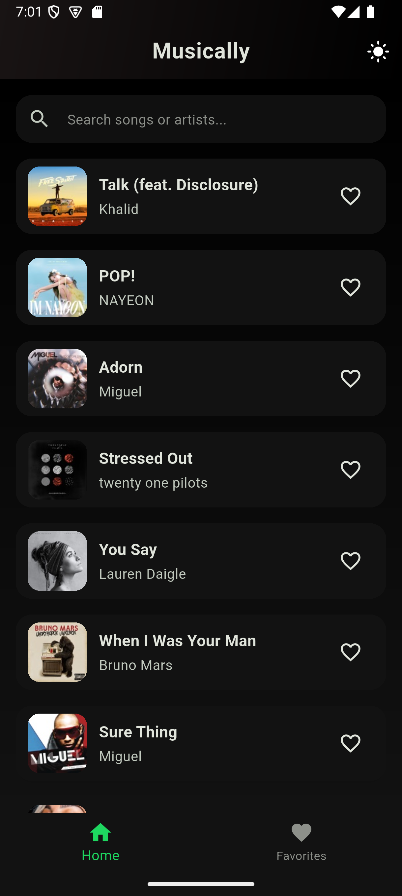
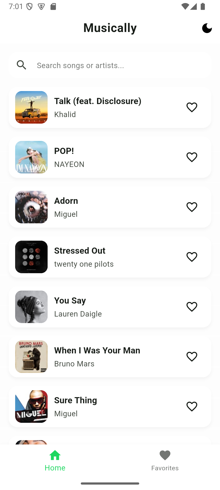
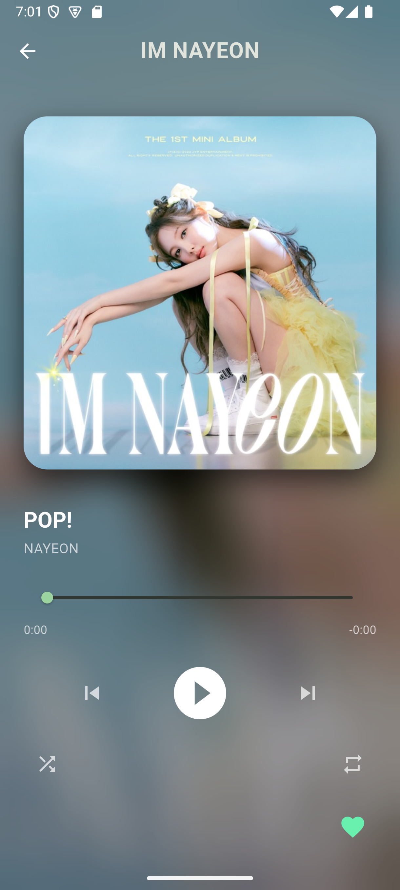
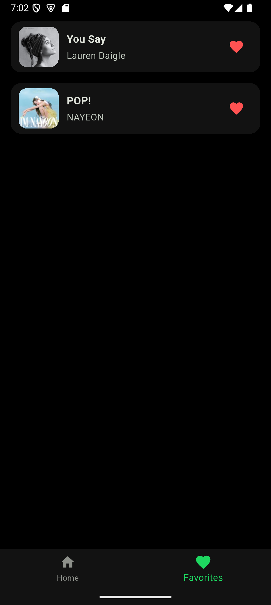

# Music Explorer App

Music Explorer is a Flutter application that lets users discover and browse music using a clean, modern UI. It is designed as a learning and starter project for building production-grade Flutter apps with a layered architecture.

## Screenshots

> The images below are stored under the `screenshots/` directory. If you rename or add screenshots, update these paths accordingly.

| Home | Search | Details |
| --- | --- | --- |
|  |  |  |

Additional screen:



## Features

- Browse music (albums / tracks / artists)
- Search by keyword
- View track / album / artist details
- Favorite / bookmark items (locally persisted)
- Responsive UI that adapts to different screen sizes
- Clean separation between UI, domain logic, and data access

> Note: The exact feature set may vary depending on the current codebase. Update this list as you add or remove features.

## Tech Stack

- **Framework:** Flutter
- **Language:** Dart
- **Architecture:** Recommended patterns such as MVVM / Clean-like layering (presentation, domain, data)
- **Networking:** `http` or a similar package (update with the actual one you use)
- **State Management:** e.g. `Provider`, `Riverpod`, `Bloc`, or `setState` (update based on the project)

## Project Structure

Typical Flutter structure (update if your structure differs):

- `lib/` – main application code
  - `main.dart` – app entry point
  - `ui/` or `presentation/` – widgets, screens, and UI state
  - `data/` – API clients, repositories, DTOs
  - `domain/` – models and use cases (if using a domain layer)
- `assets/` – images, icons, fonts
- `test/` – unit and widget tests

## Getting Started

Below are step-by-step setup instructions for running the app locally.

### 1. Install Tools

- Install the **Flutter SDK** (stable channel recommended)
- Install an IDE: **Android Studio**, **VS Code**, or **IntelliJ IDEA** with the Flutter & Dart plugins
- Install the **Android SDK** and create at least one Android emulator (via Android Studio), or prepare a physical Android device with USB debugging enabled

Verify your Flutter setup:

```bash
flutter doctor
```

Resolve any issues reported by `flutter doctor` before continuing.

### 2. Clone the Repository

```bash
git clone <your-repo-url>
cd music_explorer_app
```

### 3. Get Dependencies

From the project root, fetch all Flutter/Dart packages:

```bash
flutter pub get
```

### 4. (Optional) Configure API Keys

If the app talks to a remote music API (e.g. Spotify, Deezer, Last.fm), follow these steps (adapt as needed):

1. Create an app on the provider dashboard
2. Generate an API key / client ID
3. Add the key to a safe place, for example:
   - A `.env` file loaded at runtime, or
   - A config file under `lib/config/` (do **not** commit real secrets)
4. Update the code to read from this config if not already wired

Document the exact steps here once your API is finalized.

### 5. Run the App

List available devices (emulators / physical):

```bash
flutter devices
```

Then run the app on the selected device:

```bash
flutter run
```

To target a specific device:

```bash
flutter run -d <device_id>
```

## Configuration

If the app uses an external music API (Spotify, Deezer, Last.fm, etc.), you may need API keys or environment configuration. Common patterns:

- Store keys in a `.env` file and load with a config package
- Or keep them in `lib/config/` and **never** commit secrets to version control

Update this section with the exact steps once your API configuration is set up.

## Testing

Run all tests:

```bash
flutter test
```

If you add integration tests, document how to run them here.

## Development Guidelines

- Follow Dart & Flutter style guidelines (`dart format`)
- Prefer small, composable widgets
- Keep networking and persistence logic outside of UI widgets
- Write tests for core business logic and critical screens

## Roadmap / Ideas

- Offline support / caching
- Dark mode
- Play previews (if API supports it)
- More advanced filtering and sorting
- Localization (multi-language support)

## License

